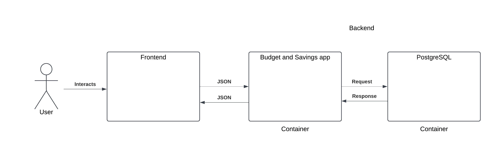
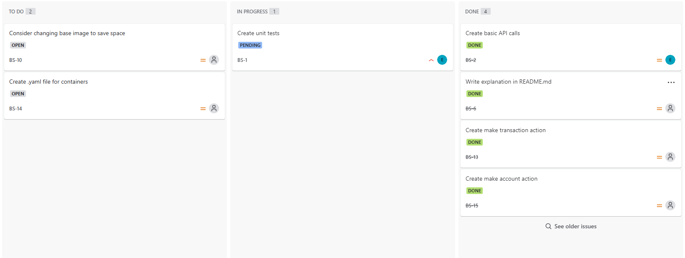

# budget_and_savings

# How to run
Create docker network:

docker network create budget_network

Run Postgres image:

docker run --network budget_network -d --name postgres -e POSTGRES_PASSWORD=password postgres:latest

Either add ./db/create_database.sql as a entrypoint volume or run the following commands in postgres container:

psql -U postgres

CREATE DATABASE budget_db;

Build app:

docker build -t budget_app .

Run app:

docker run -p 8501:8501 --network budget_network --name budget_app budget_app

# Functionality
The Budget and Savings app!

Features:

1. Make an account
2. Check account details
3. Create transaction
4. Create a savings goal
5. Check goal progress

Flow:

# Thoughts on future development
If i had worked on this for longer I would've made sure to establish a local development enviroment directly on host. After making sure the app ran fine in a container I didn't prioritize creating a local dev environment.

More ideas:

1. Account ID could be UUID.

2. Expand tests to make HTTP requests instead of only testing functions.

3. I would like to make an OpenAPI .yaml file with Swagger-UI for making easy HTTP requests.

4. More functionality.

5. More classes for better organizing

6. Connect db to pgAdmin for better overview

7. Transactions should have timestamps

8. Security, authentication

# Scope
I chose not to include security as part of the scope.

I focused heavily on making a good foundation for an app, not focusing on adding features. I feel the setup has made it easy to expand with more functionality.

I did not use the currency value

For easy testing, no data persistence has been made (could be made with adding volumes), meaning that data resets when postgres container restarts.

# Links

I'm unsure if the Jira project is visibe to guests soI included an image above.

https://budgetandsavings.atlassian.net/jira/servicedesk/projects/BS/boards/1
