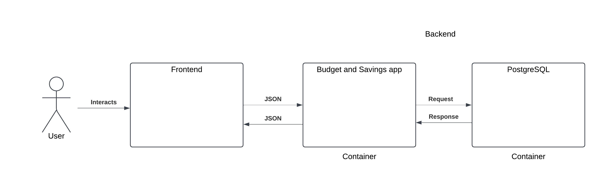
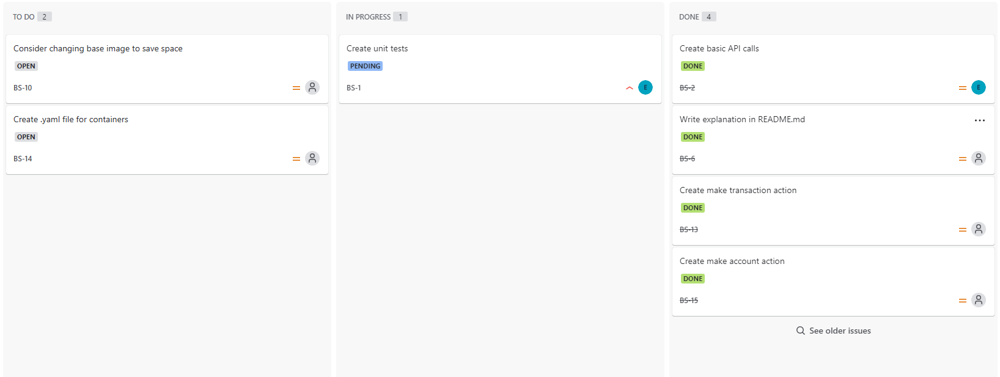
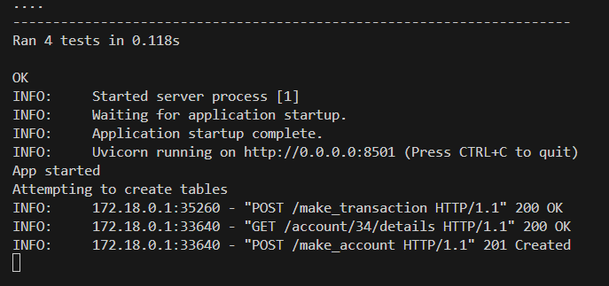
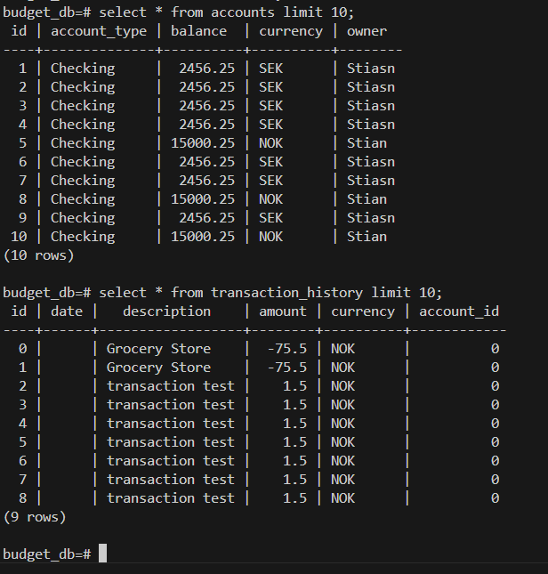
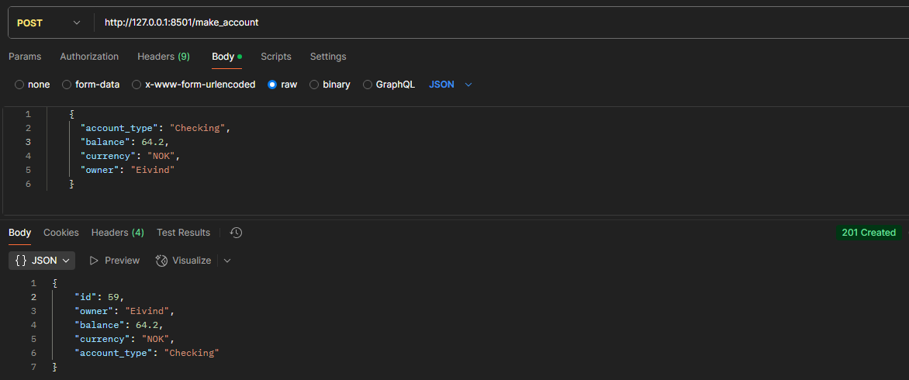

# budget_and_savings

# Description
This code is primarily the baseline for a larger budget and savings app. It only handles the backend part of the app and expects a frontend to send HTTP requests with a JSON body for data. See image below for flow.

I didn't notice there was a template for a readme file so mine might be structured a bit different to that. The app is run in docker containers and should (hopefully) be fairly straightforward to run on other devices.

# How to run
Create docker network:

docker network create budget_network

Run Postgres image:

docker run --network budget_network -d --name postgres -e POSTGRES_PASSWORD=password postgres:latest

Either add ./db/create_database.sql as a entrypoint volume or run the following commands in postgres container:

psql -U postgres

CREATE DATABASE budget_db;

Build app:

docker build -t budget_app .

Run app:

docker run -p 8501:8501 --network budget_network --name budget_app budget_app

# Functionality
The Budget and Savings app!

Features:

1. Make an account
2. Check account details
3. Create transaction

# API

Homepage:

GET http://127.0.0.1:8501/

Get account details:

http://127.0.0.1:8501/account/<account_id>/details

Make account:

POST http://127.0.0.1:8501/make_account

    {
      "account_type": "Checking",
      "balance": 64.2,
      "currency": "NOK",
      "owner": "Eivind"
    }

Make transaction:

POST http://127.0.0.1:8501/make_transaction

    {
        "description": "Grocery Store",
        "amount": -75.5,
        "currency": "NOK",
        "account_id": 0
    }

Flow:

# Thoughts on future development
If i had worked on this for longer I would've made sure to establish a local development enviroment directly on host. After making sure the app ran fine in a container I didn't prioritize creating a local dev environment.

More ideas:

1. More functionality

2. Expand tests to make HTTP requests instead of only testing functions.

3. I would like to make an OpenAPI .yaml file with Swagger-UI for making easy HTTP requests.

4. Account ID could be UUID.

5. More classes for better organizing

6. Connect db to pgAdmin for better overview

7. Transactions should have timestamps

8. Security, authentication

# Scope
I started working on saving goals, but ran out of time as I'm leaving the country for a week.

I focused heavily on making a good foundation for an app, not focusing on adding features. I feel the setup has made it easy to expand with more functionality.

I chose not to include security as part of the scope.

I did not make the port easily configurable (need to change Dockerfile)

I did not use the currency value.

Some tests may fail the first time as no entries exist, but they should pass the second time. In a real app I would address that.

I could also either host the app or reduce instructions to run it.

I did not created branches for such a small project.

For easy testing, no data persistence has been made (could be made by adding volumes), meaning that all data resets when postgres container restarts.

# Links

I'm unsure if the Jira project is visibe to guests soI included an image below.

https://budgetandsavings.atlassian.net/jira/servicedesk/projects/BS/boards/1

# Images 

Jira:

App running in terminal:

Database:

Example request:

